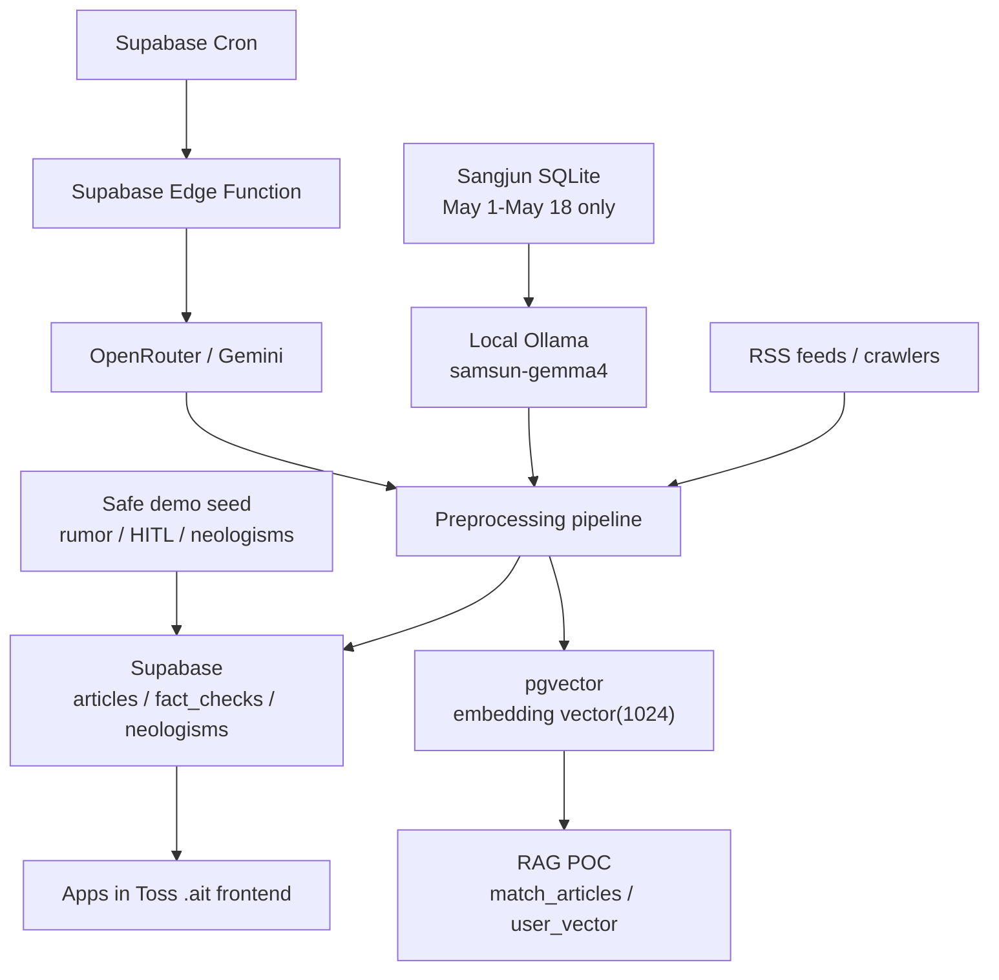

# 삼선뉴스 / Samsun News

> AI/tech news curation mini-app for Apps in Toss.  
> Raw English AI news becomes a Korean-first mobile feed with translation, summaries, trust labels, and terminology help.

## Project Overview

Samsun News is a complete AI news curation product for final demo and Apps in Toss submission.

Problem:
- AI news is fast, fragmented, mostly English, and uneven in reliability.
- A raw RSS reader does not explain technical terms, uncertainty, or source trust.
- Mobile users need short Korean summaries without losing the full translation or original source.

Solution:
- Collect AI/tech news through RSS/crawling and the Sangjun SQLite source.
- Process final-demo Sangjun data only from `2026-05-01` through `2026-05-18`.
- Generate Korean titles, full Korean translations, formal summaries, casual summaries, fact labels, and neologism terms.
- Store processed outputs in Supabase.
- Deliver a polished Apps in Toss `.ait` frontend that reads Supabase directly.

One-line description:

```text
삼선뉴스는 영문 AI 뉴스를 한국어 번역, 3줄 요약, 신뢰도 라벨, 신조어 설명까지 갖춘 토스 미니앱 뉴스 큐레이션 서비스입니다.
```

## Core AI Features

- Korean-first title policy: prefer `title_ko`; never show raw English as the main demo title.
- Full translation: detail page shows translated article body, not only a short summary.
- Tone preference: `격식체` / `일상체` summary choice persists in localStorage.
- Fact status badges: `검증됨`, `미검증`, `루머 의심`, `HITL 검토 필요`.
- Conservative safety: uncertain claims become `UNVERIFIED` or `HITL_REQUIRED`.
- Neologism annotation: terms are highlighted and explained from Supabase `neologisms`.
- pgvector RAG POC: Qwen3-Embedding-0.6B local embeddings, `articles.embedding vector(1024)`, user interest vectors, click-based vector updates, and optional LLM reranking for the local/admin backend path.
- Demo readiness filtering: old/incomplete rows are pushed down or hidden in polished demo mode.
- Safe synthetic demo examples: rumor/HITL rows are marked `[시연용]`, `source=DEMO`, and never presented as verified real news.

## Architecture



Runtime boundaries:
- Apps in Toss frontend uses only `VITE_SUPABASE_URL` and `VITE_SUPABASE_ANON_KEY`.
- Supabase is the backend/data source.
- Local `samsun-gemma4` is for offline import/backfill/demo processing.
- Local `Qwen3-Embedding-0.6B` is used by the backend/admin pgvector RAG POC through Ollama.
- Cloud scheduled refresh uses OpenRouter/Gemini from Supabase Edge/Cron.
- The `.ait` bundle does not require a custom app server.

## Final Feature Audit

| Area | Final status |
| --- | --- |
| Article embeddings | Implemented. `supabase_schema.sql` defines `articles.embedding VECTOR(1024)`, and `backend/save_articles.py` writes embeddings from `title_ko + translation`. |
| Qwen3 embedding | Implemented as local/admin POC. `backend/embedder.py` defaults `LOCAL_EMBEDDING_MODEL=qwen3-embedding:0.6b` and fits vectors to 1024 dimensions. |
| pgvector RPC | Implemented. `match_articles(...)` and `hybrid_search_articles(...)` exist in SQL; `backend/main.py` uses `match_articles` for vector search. |
| Recommendation flow | Partial POC. `backend/rag.py` supports `users.user_vector`, top 20 candidates, click-based vector updates, and optional LLM reranking. The Apps in Toss `.ait` frontend still reads Supabase directly and does not require this server. |
| Neologism DB | Implemented. `supabase_schema.sql` creates `neologisms`; `backend/sql/neologisms_pgvector.sql` adds `embedding VECTOR(1024)` and `match_neologisms`. |
| Neologism generation/tracking | Implemented with schema-dependent article fields. Pipeline extracts terms, writes `neologisms`, and writes `slang_terms` / `neologism_terms` when migrated. |
| Frontend neologism UI | Implemented. `frontend/src/components/NeologismText.tsx` highlights known terms and opens a mobile bottom sheet; unknown terms are not explained unless Supabase has an explanation. |

Full audit: [`docs/FINAL_FEATURE_AUDIT.md`](docs/FINAL_FEATURE_AUDIT.md)

## Evaluation Rubric Mapping

| Rubric category | Evidence in this repo |
| --- | --- |
| AI model selection and preprocessing design | `docs/MODEL_STRATEGY.md`, `scripts/process_sangjun_sqlite_with_ollama.py`, May-range filtering, quality thresholds |
| Model training/evaluation/improvement strategy | local `samsun-gemma4` serving plan, audit/backfill scripts, documented quantitative-evaluation limitations |
| Real-service architecture | Apps in Toss `.ait`, Supabase direct read, Supabase Edge/Cron cloud refresh, no custom server dependency in app runtime |
| Data collection/preprocessing implementation | RSS crawler, Sangjun SQLite audit/import, preprocessing, Supabase upsert, demo readiness filtering |
| AI model training/tuning implementation | local Ollama/GGUF model path, title/translation/summary/fact generation, robust JSON retry/skip |
| System stability | `typecheck`, `lint`, Vite build, `.ait` build, optional neologism lookup, visible error/empty states |
| Presentation/storytelling | final demo scenario, architecture, model strategy, data pipeline, test checklist |
| Collaboration | clear separation of frontend, data, model, Supabase automation, and demo QA runbooks |

Full mapping:

- [`docs/EVALUATION_RUBRIC_MAPPING.md`](docs/EVALUATION_RUBRIC_MAPPING.md)
- [`docs/FINAL_DEMO_SCENARIO.md`](docs/FINAL_DEMO_SCENARIO.md)
- [`docs/FINAL_ARCHITECTURE.md`](docs/FINAL_ARCHITECTURE.md)
- [`docs/MODEL_STRATEGY.md`](docs/MODEL_STRATEGY.md)
- [`docs/DATA_PIPELINE.md`](docs/DATA_PIPELINE.md)
- [`docs/FINAL_TEST_CHECKLIST.md`](docs/FINAL_TEST_CHECKLIST.md)

## Quick Start

### Frontend

```bash
cd frontend
npm install
copy .env.example .env.local
```

Set frontend-safe environment values only:

```env
VITE_SUPABASE_URL=<supabase-project-url>
VITE_SUPABASE_ANON_KEY=<supabase-anon-key>
VITE_DEMO_POLISHED_FEED=1
```

Run locally:

```bash
npm run dev
```

Build:

```bash
npm run build
npm run ait:build
```

Upload this local artifact to Apps in Toss console:

```text
frontend/samsun-newsapp.ait
```

### Backend / Batch Environment

Batch scripts use the repository root `.env`, based on `.env.example`.

```bash
copy .env.example .env
pip install -r requirements.txt
```

Local model settings for demo/backfill:

```env
LLM_PROVIDER=ollama
MODE=local
MODEL_NAME=samsun-gemma4
OLLAMA_BASE_URL=http://localhost:11434
```

Local embedding/RAG POC settings:

```env
EMBEDDING_PROVIDER=local
LOCAL_EMBEDDING_MODEL=qwen3-embedding:0.6b
RAG_LLM_RERANK_ENABLED=0
```

Prepare local embedding model:

```bash
ollama pull qwen3-embedding:0.6b
```

Cloud refresh settings use Supabase Edge/Cron plus OpenRouter or Gemini secrets.

Optional local/admin RAG POC:

```bash
uvicorn backend.main:app --reload
curl -X POST http://localhost:8000/onboarding -H "Content-Type: application/json" -d "{\"user_id\":\"demo\",\"interest_tags\":[\"AI\",\"반도체\",\"RAG\"]}"
curl http://localhost:8000/feed/demo?top_k=10
curl -X POST http://localhost:8000/users/demo/click/<url_hash>
```

## Demo Operation Commands

Audit Supabase demo readiness:

```bash
python scripts/audit_demo_readiness.py
```

Audit Sangjun SQLite May range:

```bash
python scripts/audit_sangjun_sqlite.py --db-path samsun_345.db --since 2026-05-01 --until 2026-05-18
```

Dry-run local Ollama processing:

```bash
python scripts/process_sangjun_sqlite_with_ollama.py --db-path samsun_345.db --since 2026-05-01 --until 2026-05-18 --limit 3 --dry-run
```

Process and upsert a small batch:

```bash
python scripts/process_sangjun_sqlite_with_ollama.py --db-path samsun_345.db --since 2026-05-01 --until 2026-05-18 --limit 20 --upsert-supabase
```

Seed safe demo examples:

```bash
python scripts/seed_demo_articles.py
```

Preview demo feed cleanup:

```bash
python scripts/prepare_demo_feed.py --since 2026-05-01 --until 2026-05-18 --limit 1000
```

Apply cleanup only after backup:

```bash
python scripts/export_articles_backup.py
python scripts/prepare_demo_feed.py --since 2026-05-01 --until 2026-05-18 --limit 1000 --run
```

## Key Directories

| Path | Purpose |
| --- | --- |
| `frontend/` | Apps in Toss React/Vite mini-app |
| `supabase/functions/refresh-articles/` | Supabase Edge refresh function |
| `backend/` | Supabase helpers, fact/neologism/RAG support modules |
| `collect/` | RSS crawler |
| `pipeline/` | translation and summary pipeline |
| `fact_checker/` | fact labeling and risk classification |
| `scripts/` | audit, import, backfill, seed, and demo-readiness tools |
| `backend/sql/` | Supabase migrations |
| `docs/` | final presentation/runbook documents |

## Security And GitHub Safety

Never commit:
- `.env` or machine-specific `.env.*`
- API keys or Supabase service-role keys
- `.ait` bundles
- `.gguf` model files
- `samsun_345`, `samsun_345.db`, or other local DB files
- `ollama-model/`
- `node_modules/`, `dist/`, logs, caches

Use:
- `.env.example`
- `frontend/.env.example`
- `backend/.env.example`

## Final Build Checks

```bash
python scripts/audit_demo_readiness.py
python -m compileall main.py backend scripts pipeline fact_checker collect
cd frontend
npm run typecheck
npm run lint
npm run build
npm run ait:build
```

## Current Limitations

- Local Ollama is not used inside hosted Supabase Edge Functions; cloud refresh uses OpenRouter/Gemini.
- Quantitative BLEU/COMET/G-Eval style evaluation can be expanded after the final demo.
- Some old Supabase rows are incomplete; polished demo mode prioritizes May-range processed rows and safe demo examples.
