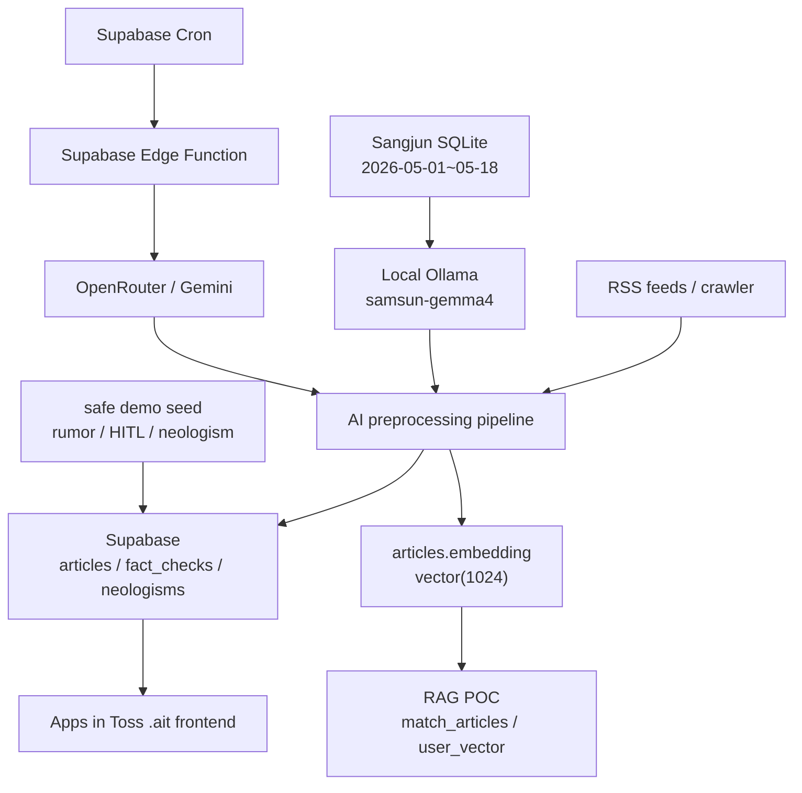

# 삼선뉴스 / Samsun News

> 영문 AI 뉴스를 한국어 제목, 번역 전문, 3줄 요약, 팩트 라벨, 신조어 설명까지 갖춘 Apps in Toss 뉴스 큐레이션 서비스로 만드는 프로젝트입니다.

English summary: Samsun News is an Apps in Toss mini-app that turns English AI/tech news into a Korean-first curated feed with full translation, formal/casual summaries, fact-status labels, neologism explanations, and Supabase-backed demo data.

## 1. 프로젝트 개요

삼선뉴스는 단순 RSS 리더가 아니라, 영문 AI/테크 뉴스를 한국어 사용자에게 바로 읽을 수 있는 모바일 큐레이션 경험으로 바꾸는 서비스입니다.

문제:
- AI 뉴스는 빠르게 쏟아지지만 대부분 영어이고, 품질과 신뢰도가 일정하지 않습니다.
- 기술 용어와 신조어가 많아 일반 사용자가 맥락을 따라가기 어렵습니다.
- 모바일에서는 긴 원문보다 한국어 제목, 짧은 요약, 필요할 때 보는 번역 전문이 더 중요합니다.

해결:
- RSS/crawling 및 Sangjun SQLite 데이터를 수집합니다.
- 최종 데모 데이터는 `2026-05-01`부터 `2026-05-18`까지만 사용합니다.
- local Ollama `samsun-gemma4`로 한국어 제목, 번역 전문, 격식체/일상체 3줄 요약, 팩트 라벨, 신조어 후보를 생성합니다.
- Supabase에 기사와 AI 결과를 저장합니다.
- Apps in Toss `.ait` 프론트엔드는 Supabase를 직접 읽어 모바일 UI로 보여줍니다.

## 2. 핵심 기능

- 한국어 우선 제목: `title_ko`를 우선 표시하고, 데모 화면에서 영문 제목이 앞에 나오지 않도록 처리합니다.
- 번역 전문: 상세 화면에서 짧은 요약이 아니라 `translation` 전체 본문을 접이식으로 보여줍니다.
- 말투 선택: `격식체` / `일상체` 요약 선택을 localStorage에 저장하고 전체 카드/상세에 적용합니다.
- 팩트 라벨: `검증됨`, `미검증`, `루머 의심`, `HITL 검토 필요`를 카드와 상세에 표시합니다.
- 보수적 안전 정책: 확실하지 않은 내용은 검증된 사실처럼 말하지 않고 `UNVERIFIED` 또는 `HITL_REQUIRED`로 낮춥니다.
- 신조어 RAG: Supabase `neologisms`에 등록된 용어만 하이라이트하고, 모바일 bottom sheet로 설명합니다.
- Qwen3 임베딩/RAG 추천 POC: `articles.embedding vector(1024)`, `users.user_vector`, `match_articles` 기반 로컬/admin 추천 구조를 제공합니다.
- 안전한 시연 데이터: 루머/HITL 예시는 `[시연용]`, `source=DEMO`, `fact_status=rumor/unverified/hitl_required`로 명확히 표시합니다.

## 3. 전체 아키텍처



런타임 경계:
- `.ait` 프론트엔드는 `VITE_SUPABASE_URL`, `VITE_SUPABASE_ANON_KEY`만 사용합니다.
- Supabase가 데이터 백엔드입니다.
- local Ollama `samsun-gemma4`는 데모/백필/SQLite import용입니다.
- Supabase Edge는 localhost Ollama를 사용할 수 없으므로 cloud refresh는 OpenRouter/Gemini를 사용합니다.
- Qwen3-Embedding-0.6B 기반 RAG는 local/admin POC이며, `.ait` 앱 실행에 필수는 아닙니다.

자세한 문서:
- [최종 아키텍처](docs/FINAL_ARCHITECTURE.md)
- [데이터 파이프라인](docs/DATA_PIPELINE.md)
- [모델 전략](docs/MODEL_STRATEGY.md)
- [최종 기능 점검](docs/FINAL_FEATURE_AUDIT.md)

## 4. 구현 상태 요약

| 영역 | 상태 | 실제 근거 |
| --- | --- | --- |
| Apps in Toss `.ait` 프론트엔드 | 실제 구현 | `frontend/`, `frontend/granite.config.ts`, `frontend/package.json` |
| Supabase 기사 조회 | 실제 구현 | `frontend/src/data/api.ts`, `frontend/src/lib/supabase.ts` |
| 한국어 제목/번역/요약 표시 | 실제 구현 | `frontend/src/data/articles.ts`, `frontend/src/pages/DetailPage.tsx` |
| 말투 선택 저장 | 실제 구현 | `frontend/src/hooks/useTonePreference.ts`, `TonePreferenceControl` |
| 팩트 라벨 UI | 실제 구현 | `frontend/src/components/FactStatusBadge.tsx` |
| 신조어 하이라이트/bottom sheet | 실제 구현 | `frontend/src/components/NeologismText.tsx`, `frontend/src/components/Overlay.tsx` |
| neologisms 테이블/RPC | 실제 구현 | `supabase_schema.sql`, `backend/sql/neologisms_pgvector.sql` |
| `articles.slang_terms` / `neologism_terms` | 부분 구현 | `backend/sql/add_pipeline_tracking_fields.sql` 적용 시 저장 |
| Qwen3 임베딩 | POC 구현 | `backend/embedder.py`, `.env.example` |
| pgvector `match_articles` | 실제 구현 | `supabase_schema.sql`, `backend/sql/add_title_ko.sql` |
| user_vector 추천/클릭 업데이트 | POC 구현 | `backend/rag.py`, `backend/main.py` |
| LLM re-ranking | 선택형 POC | `RAG_LLM_RERANK_ENABLED=1`일 때 local/admin 서버에서 사용 |

## 5. 신조어 RAG

신조어 기능은 “모르는 용어를 그럴듯하게 지어내는 기능”이 아니라, Supabase에 등록된 용어 설명만 UI에 표시하는 안전한 RAG 방식입니다.

구성:
- 테이블: `neologisms`
- pgvector migration/RPC: `backend/sql/neologisms_pgvector.sql`
- 기본 schema 반영: `supabase_schema.sql`
- 기사별 후보 필드: `slang_terms`, `neologism_terms`
- 백엔드 추출/저장: `backend/neologism_rag.py`, `backend/save_articles.py`
- 프론트 조회: `frontend/src/data/api.ts`
- 프론트 UI: `frontend/src/components/NeologismText.tsx`
- 데모 seed: `scripts/seed_demo_articles.py`

정책:
- 설명이 없는 unknown term은 UI에서 설명하지 않습니다.
- `neologisms.explanation`이 있는 항목만 하이라이트합니다.
- 모바일에서는 tap 시 bottom sheet, 데스크톱에서는 hover tooltip을 제공합니다.

자세한 문서:
- [신조어 RAG 문서](docs/NEOLOGISM_RAG.md)

## 6. Qwen3 임베딩 / pgvector RAG 추천

요청 검색어:

```bash
rg -n "embedding|Qwen3|pgvector|vector|user_vector|match_articles|feed-llm|rerank|recommend" .
```

점검 결과:

| 항목 | 상태 | 설명 |
| --- | --- | --- |
| `articles.embedding VECTOR(1024)` | 실제 구현 | `supabase_schema.sql`에 존재 |
| 기사 임베딩 생성 | 실제 구현 | `backend/save_articles.py`가 `title_ko + translation`을 임베딩 |
| Qwen3-Embedding-0.6B | POC 구현 | `backend/embedder.py` 기본 local embedding model |
| `match_articles` RPC | 실제 구현 | pgvector cosine similarity 검색 |
| `hybrid_search_articles` | 실제 구현 | vector + trigram keyword fusion |
| `users.user_vector` | POC 구현 | `supabase_schema.sql`, `backend/rag.py` |
| 클릭 기반 vector 업데이트 | POC 구현 | `POST /users/{user_id}/click/{url_hash}` |
| top 20 후보 추출 | POC 구현 | `fetch_recommendation_candidates(..., candidate_k=20)` |
| LLM re-ranking | 선택형 POC | 기본 비활성, OpenRouter/Gemini key 필요 |
| `.ait` 앱 내 개인화 추천 | 미구현 | 최종 앱은 Supabase 직접 조회 중심 |

로컬/admin POC 실행:

```bash
ollama pull qwen3-embedding:0.6b

set EMBEDDING_PROVIDER=local
set LOCAL_EMBEDDING_MODEL=qwen3-embedding:0.6b
uvicorn backend.main:app --reload

curl -X POST http://localhost:8000/onboarding ^
  -H "Content-Type: application/json" ^
  -d "{\"user_id\":\"demo\",\"interest_tags\":[\"AI\",\"반도체\",\"RAG\"]}"

curl http://localhost:8000/feed/demo?top_k=10
curl -X POST http://localhost:8000/users/demo/click/<url_hash>
```

발표 표현:
- “Qwen3-Embedding-0.6B와 pgvector 기반 추천은 최종 `.ait` 필수 런타임이 아니라, 로컬/admin POC로 구현했습니다.”
- “보고서의 RAG 추천 구조는 `articles.embedding`, `users.user_vector`, `match_articles`, 클릭 기반 vector 업데이트까지 코드로 확인 가능합니다.”
- “LLM 재정렬은 후속 고도화 항목이며, 현재는 선택형 POC로 비활성화되어 있습니다.”

## 7. Apps in Toss 제출/테스트

현재 설정:

| 항목 | 상태 |
| --- | --- |
| `ait:dev` | 있음 |
| `ait:build` | 있음 |
| `ait:deploy` | 있음 |
| `appName` | `samsun-newsapp` |
| `brand.displayName` | `삼선뉴스` |
| `brand.primaryColor` | `#3182F6` |
| `brand.icon` | `/favicon.svg` |
| `permissions` | `[]` |
| `outdir` | `dist` |
| 실기기 host | `AIT_WEB_HOST` 지원 |

최종 산출물:

```text
frontend/samsun-newsapp.ait
```

중요: Apps in Toss `.ait`는 빌드 시점의 `VITE_*` 환경변수가 번들에 포함됩니다. `frontend/.env.local` 또는 빌드 시점 환경변수에 아래 값이 없으면 `npm run build` / `npm run ait:build`가 실패하도록 prebuild check를 추가했습니다.

```env
VITE_SUPABASE_URL=<supabase-project-url>
VITE_SUPABASE_ANON_KEY=<supabase-anon-key>
VITE_DEMO_POLISHED_FEED=1
VITE_HIDE_DEMO_ARTICLES=1
```

`frontend/.env.local`은 로컬 빌드용이며 커밋하지 않습니다. 제출용 문서에는 `frontend/.env.example`만 포함합니다.

빌드:

```bash
cd frontend
npm run build
npm run ait:build
```

Toss Console 시연 순서:

1. Apps in Toss Console에서 `samsun-newsapp` 선택
2. `frontend/samsun-newsapp.ait` 업로드
3. 테스트 빌드 등록
4. 실기기 Toss 앱에서 삼선뉴스 실행
5. 홈 피드 확인
6. 기사 상세 확인
7. `격식체` / `일상체` 전환
8. 팩트 라벨 확인
9. 신조어 bottom sheet 확인
10. `원문 보기` 링크 확인

체크리스트 문서:
- [Apps in Toss 비게임 체크리스트 대응](docs/APPS_IN_TOSS_CHECKLIST.md)

## 8. 실행 방법

프론트엔드:

```bash
cd frontend
npm install
copy .env.example .env.local
npm run dev
```

`frontend/.env.local`에는 공개 가능한 anon 값만 넣습니다.

```env
VITE_SUPABASE_URL=<supabase-project-url>
VITE_SUPABASE_ANON_KEY=<supabase-anon-key>
VITE_DEMO_POLISHED_FEED=1
```

백엔드/배치:

```bash
copy .env.example .env
pip install -r requirements.txt
```

Sangjun SQLite May range 점검:

```bash
python scripts/audit_sangjun_sqlite.py --db-path samsun_345.db --since 2026-05-01 --until 2026-05-18
```

local Ollama 처리:

```bash
python scripts/process_sangjun_sqlite_with_ollama.py --db-path samsun_345.db --since 2026-05-01 --until 2026-05-18 --limit 20 --upsert-supabase
```

데모 데이터 seed:

```bash
python scripts/seed_demo_articles.py
```

데모 readiness 점검:

```bash
python scripts/audit_demo_readiness.py
```

최종 발표용 피드 정리:

```bash
python scripts/prepare_final_presentation_feed.py --dry-run
python scripts/prepare_final_presentation_feed.py --run
```

## 9. 최종 검증 명령

```bash
python -m compileall main.py backend scripts pipeline fact_checker collect
cd frontend
npm run typecheck
npm run lint
npm run build
npm run ait:build
```

## 10. 보안 / 제출 주의

커밋 금지:
- `.env`, `.env.*`
- Supabase service role key
- API keys
- `.ait`
- `.gguf`
- `samsun_345`, `samsun_345.db`
- `ollama-model/`
- `node_modules/`, `dist/`, logs, caches

최종 GitHub 제출에는 코드, 문서, migration, env example만 포함합니다.

## 11. 현재 한계

- Supabase Edge Function은 localhost Ollama를 사용할 수 없습니다. Cloud refresh는 OpenRouter/Gemini 경로를 사용합니다.
- Qwen3 임베딩/RAG 추천은 local/admin POC이며, 최종 `.ait` 앱의 필수 사용자 흐름은 Supabase 기사 피드입니다.
- LLM re-ranking은 선택형 POC로 남겨두었고, 실제 서비스 고도화 단계에서 평가/튜닝이 필요합니다.
- 기존 Supabase rows 중 일부는 불완전할 수 있어 polished demo mode가 May-range 처리 기사와 안전한 데모 예시를 우선합니다.
