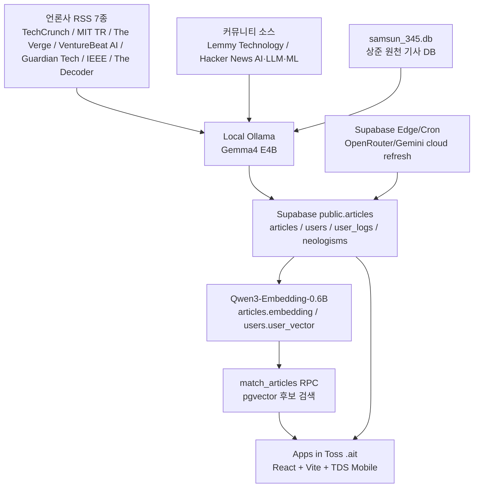
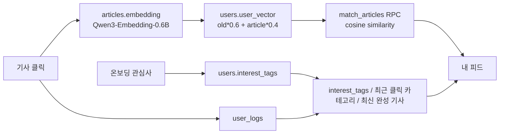

# 삼선뉴스 — AI/IT 뉴스 번역·요약·개인화 추천 Toss 미니앱

> Global AI/Tech news -> Korean summaries, trust labels, neologism explanations, and personalized feed inside Apps in Toss.

삼선뉴스는 해외 AI·IT 뉴스를 수집해 한국어 제목, 전문 번역, 격식체/일상체 3줄 요약, 팩트 라벨, 신조어 설명, 개인화 추천 피드까지 제공하는 Apps in Toss 미니앱입니다.  
최종 앱은 `frontend/samsun-newsapp.ait`로 빌드되며, 런타임에서는 Supabase `public.articles`를 직접 조회합니다.  
단순 RSS 리더가 아니라 “수집 -> AI 전처리 -> 신뢰도/용어 보강 -> 모바일 큐레이션”까지 이어지는 한국어 AI 뉴스 제품을 목표로 만들었습니다.

## 왜 만들었나

| 문제 | 삼선뉴스의 해결 방식 |
| --- | --- |
| AI·IT 뉴스는 대부분 영어로 빠르게 쏟아진다 | 한국어 제목, 전문 번역, 3줄 요약을 자동 생성 |
| 긴 원문은 모바일에서 읽기 어렵다 | 카드에는 요약, 상세에는 접이식 번역 전문 제공 |
| 기술 용어와 신조어가 많다 | Supabase `neologisms` 기반 RAG 설명과 bottom sheet 제공 |
| 출처와 신뢰도 판단이 어렵다 | `FACT`, `UNVERIFIED`, `RUMOR`, `INSIGHT`, `HITL_REQUIRED` 라벨 표시 |
| 모든 사용자에게 같은 뉴스만 보인다 | 온보딩 관심사와 클릭 이력 기반 개인화 추천 제공 |

## 핵심 기능

| 기능 | 최종 구현 상태 |
| --- | --- |
| Apps in Toss 미니앱 | React 18 + Vite + TypeScript + TDS Mobile, `.ait` 번들 생성 |
| 한국어 우선 기사 피드 | `title_ko`, `translation`, `summary_formal`, `summary_casual` 기반 표시 |
| 말투 선택 | `격식체` / `일상체` 선호를 localStorage에 저장하고 카드/상세에 적용 |
| 원문 보기 | `url -> source_url -> original_url` 순서로 fallback, 유효한 http(s) 링크만 열기 |
| 핫이슈 | 조회 로그가 없어도 최신/신뢰도 기반 fallback으로 빈 화면 방지 |
| 개인화 추천 | `interest_tags`, `user_logs`, `user_vector`, `match_articles` RPC + fallback |
| 신조어 RAG | 등록된 용어만 하이라이트, 설명 없는 용어는 표시하지 않음 |
| Fact label / HITL | 라벨과 `fact_reason` / `fact_insight`를 상세에 표시 |
| 발표용 피드 정리 | old/DEMO/미완성 기사는 삭제하지 않고 `is_hidden=true`로 숨김 |

## 최종 구현 현황

| 영역 | 구현 수준 | 근거 파일 |
| --- | --- | --- |
| 앱 화면과 `.ait` 빌드 | 실제 구현 | `frontend/`, `frontend/granite.config.ts`, `frontend/package.json` |
| Supabase 직접 조회 | 실제 구현 | `frontend/src/data/api.ts`, `frontend/src/lib/supabase.ts` |
| 데이터 정리/감사 | 실제 구현 | `scripts/audit_demo_readiness.py`, `scripts/prepare_final_presentation_feed.py` |
| SQLite -> AI 처리 -> Supabase upsert | 실제 구현 | `scripts/process_sangjun_sqlite_with_ollama.py`, `scripts/sangjun_sqlite_common.py` |
| pgvector 추천 RPC | 실제 구현 | `backend/sql/final_demo_supabase_patch.sql` |
| 개인화 추천 fallback | 실제 구현 | `frontend/src/data/api.ts`, `frontend/src/pages/MyFeedPage.tsx` |
| 신조어 하이라이트 | 실제 구현 | `frontend/src/components/NeologismText.tsx`, `frontend/src/components/Overlay.tsx` |
| fact insight / HITL 표시 | 실제 구현 | `frontend/src/pages/DetailPage.tsx`, `scripts/backfill_fact_insights.py` |
| LLM Re-ranking | 후속 고도화 | 최종 데모 기본 비활성, Gemma4 기반 확장 옵션 |

## 시스템 아키텍처



런타임 기준:
- 최종 앱은 SQLite를 직접 읽지 않습니다.
- 최종 앱은 별도 서버를 요구하지 않고 Supabase `public.articles`를 직접 조회합니다.
- `samsun_345.db`는 원천 기사 SQLite DB이며, 최종 흐름은 `SQLite -> Gemma4/Ollama 처리 -> Supabase upsert -> .ait 앱 조회`입니다.
- cloud refresh는 Supabase Edge/Cron + OpenRouter/Gemini 경로입니다. Supabase Edge는 localhost Ollama를 사용할 수 없습니다.

## 데이터 수집 파이프라인

| 구분 | 최종 소스 | 수집 방식 |
| --- | --- | --- |
| 언론사 RSS | TechCrunch | RSS |
| 언론사 RSS | MIT Technology Review | RSS |
| 언론사 RSS | The Verge | RSS |
| 언론사 RSS | VentureBeat AI | RSS |
| 언론사 RSS | The Guardian Tech | RSS |
| 언론사 RSS | IEEE Spectrum | RSS |
| 언론사 RSS | The Decoder | RSS |
| 커뮤니티 | Lemmy Technology | RSS + Lemmy API `post_view.post.embed_description` |
| 커뮤니티 | Hacker News AI/LLM/ML | hnrss.org 키워드 필터 RSS |

Reddit은 최종 수집 대상에서 제외했습니다. API/RSS 접근 정책 변화와 데이터 라이선싱 리스크 때문에 안정적인 공개 수집 파이프라인으로 쓰기 어렵다고 판단했고, 대신 Lemmy + Hacker News를 커뮤니티 기반 AI/LLM/ML 소스로 사용했습니다.

## AI 파이프라인

Gemma4 E4B는 May 1~18 원천 기사에 대해 한 번의 구조화된 생성으로 아래 필드를 만듭니다.

| 생성 필드 | 설명 |
| --- | --- |
| `title_ko` | 한국어 제목 |
| `translation` | 한국어 번역 전문 |
| `summary_formal` | 격식체 3줄 요약 |
| `summary_casual` | 일상체 3줄 요약 |
| `category` | 최종 7개 카테고리 중 하나 |
| `fact_label` / `fact_status` | 검증/확인 필요/루머/분석글/전문가 검토 상태 |
| `neologism_terms` | 설명 후보가 되는 기술 용어 |

최종 카테고리:
- AI 연구
- AI 심층
- AI 스타트업
- AI 윤리
- AI 비즈니스
- AI 커뮤니티
- 테크 전반

모델 전략:
- 최종 번역/요약/분류: Gemma4 E4B
- Qwen 계열 번역 모델: 초기 실험에서 한자 혼입 이슈가 있어 최종 메인 번역 모델에서 제외
- Qwen3-Embedding-0.6B: 기사/사용자 임베딩 전용
- Qwen3.5: 최종 추천 LLM으로 사용하지 않음
- LLM Re-ranking: 최종 데모 기본 비활성, Gemma4 기반 후속 확장 옵션

## 개인화 추천 / RAG

삼선뉴스의 최종 추천은 LLM Re-ranking이 아니라 Supabase pgvector + fallback을 기본 경로로 사용합니다.



구현 범위:
- 온보딩 관심사는 `users.interest_tags`에 저장합니다.
- 기사 클릭은 `user_logs`에 저장합니다.
- 클릭한 기사에 embedding이 있으면 `users.user_vector = old * 0.6 + article * 0.4`로 갱신합니다.
- `match_articles` RPC로 pgvector 후보를 가져옵니다.
- RPC 또는 embedding이 없으면 관심사, 최근 클릭 카테고리, 최신 완성 기사 기반 fallback 추천을 제공합니다.
- 추천 이유는 deterministic reason입니다. 예: “선택한 관심사와 맞는 기사입니다.”

## 신조어 RAG

신조어 기능은 모르는 용어를 임의 생성하는 기능이 아닙니다. Supabase `neologisms` 테이블에 등록된 설명만 UI에 표시합니다.

| 정책 | 설명 |
| --- | --- |
| allowlist 기반 | `RAG`, `LLM`, `Fine-tuning`, `Prompt Injection`, `Guardrail`, `Hallucination`, `LoRA`, `pgvector`, `MCP`, `AI Agent`, `Context Engineering` 등 발표용 핵심 용어 중심 |
| 오탐 방지 | `The`, `Tech`, `Technology`, `AI`, `Meta`, `Google`, `OpenAI`, `Anthropic`, `Nvidia`, `TechCrunch` 등 일반 단어/회사명/출처명 제외 |
| 설명 없는 용어 | 하이라이트하지 않음 |
| 클릭 매칭 | 클릭한 용어 객체의 설명만 표시, generic fallback 없음 |
| UI | 모바일 tap 시 bottom sheet, 데스크톱 hover tooltip |

신규 용어 설명 생성은 앱 런타임에서 Gemini/Grounding을 호출하지 않습니다. `backend/neologism_rag.py`에는 `NEOLOGISM_PIPELINE_GEMINI=1`일 때만 쓰는 배치/관리용 옵션이 있으며, 최종 사용자 앱은 Supabase `neologisms`에 이미 저장된 설명만 조회합니다.

## Fact label / HITL / Insight

팩트체크 파이프라인은 사람이 매번 직접 판정하는 구조가 아니라 AI 파이프라인이 자동으로 1차 판정합니다. testset 200건과 DebateCV 검증용 실제 AI 테크 기사 1건, 총 201건으로 평가했으며, 최종 신뢰도 분류 정확도 98.5%, RUMOR recall 1.0, FACT F1 0.989를 달성했습니다. 앱에서는 AI가 자동 판정한 FACT/RUMOR/UNVERIFIED/INSIGHT 라벨을 표시하고, 자동 판정만으로 어려운 기사는 전문가 검토 필요(HITL_REQUIRED) 대상으로 분리합니다.

| 라벨 | 화면 표시 | 의미 |
| --- | --- | --- |
| `FACT` / `VERIFIED` | 검증됨 | 신뢰도 높은 출처와 명확한 보도 형식 |
| `UNVERIFIED` | 확인 필요 | 출처는 확인되지만 독립 교차검증 정보가 부족함 |
| `RUMOR` | 루머 주의 | 공식 발표보다 추정성 표현이 많음 |
| `INSIGHT` | 분석글 | 전문가 해설·관점이 중심인 TIER 0/1 사설·분석글 보존 라벨 |
| `HITL_REQUIRED` / `HITL` / `HUMAN_REVIEW` | 전문가 검토 필요 | 자동 판정만으로 판단이 어려워 사람 검토 필요 |
| `DROP` | 노출 안 함 | 커뮤니티 노이즈나 최종 피드 부적합 항목 |

`fact_reason` 또는 `fact_insight`가 있는 경우 상세 화면에 보수적인 설명을 표시하고, 값이 없으면 라벨별 기본 설명만 표시합니다.  
HITL은 “완전한 관리자 승인 시스템”이 아니라 “검토 대상 분리 및 표시 구현”입니다. 운영 단계에서는 관리자 승인/반려 플로우로 확장할 수 있도록 설계했습니다. INSIGHT는 단순 루머나 노이즈가 아니라 신뢰 가능한 전문가 해설·관점 중심 글을 DROP하지 않고 보존하기 위한 라벨입니다.

발표용 내부 Fact Review POC는 Apps in Toss 사용자 앱이 아니라 FastAPI/local 경로로 분리했습니다. `ADMIN_REVIEW_ENABLED=1`로 로컬 서버를 실행하면 `/admin/fact-review`, `/admin/hitl`, 또는 `/admin/hitl-candidates`에서 `HITL_REQUIRED`, `UNVERIFIED`, `RUMOR`, `INSIGHT` 검토 대상 목록을 확인할 수 있습니다. 쓰기 API(`/admin/hitl-review`)는 로컬 backend 환경에 `SUPABASE_SERVICE_ROLE_KEY`가 있을 때만 사용할 수 있으며, `.ait` 앱에는 service role key가 들어가지 않습니다.

## Apps in Toss 배포 / 시연

최종 산출물:

```text
frontend/samsun-newsapp.ait
```

`.ait` 빌드 전 필수 환경변수:

```env
VITE_SUPABASE_URL=<supabase-project-url>
VITE_SUPABASE_ANON_KEY=<supabase-anon-key>
VITE_DEMO_POLISHED_FEED=1
VITE_HIDE_DEMO_ARTICLES=1
```

`frontend/.env.local`은 로컬 빌드용이며 커밋하지 않습니다.

시연 체크리스트:
1. Toss Console test8에 `frontend/samsun-newsapp.ait` 업로드
2. 실기기 Toss 앱에서 삼선뉴스 실행
3. 홈 피드에서 한국어 제목, 요약, 카테고리, fact label 확인
4. 7개 카테고리 탭 확인
5. 기사 상세에서 격식체/일상체 요약 전환
6. 번역 전문 펼치기
7. 원문 링크 열기
8. 핫이슈 탭 확인
9. 내 피드/개인화 추천과 추천 이유 확인
10. 신조어 bottom sheet 확인
11. HITL/fact insight 표시 확인

## 최종 데모 데이터 스냅샷

2026-05-19 최종 감사 기준입니다.

| 항목 | 값 |
| --- | ---: |
| 최종 노출 가능 기사 수 | 105 |
| DEMO/[시연용] 노출 위반 | 0 |
| 미완성 노출 위반 | 0 |
| URL 없는 노출 기사 | 0 |
| invalid URL | 0 |
| 핫이슈 후보 | 105 |
| visible fact insight/reason 보유 기사 | 40 |
| visible HITL_REQUIRED 기사 | 2 |

카테고리 분포:

| 카테고리 | 기사 수 |
| --- | ---: |
| AI 연구 | 16 |
| AI 심층 | 13 |
| AI 스타트업 | 8 |
| AI 윤리 | 15 |
| AI 비즈니스 | 37 |
| AI 커뮤니티 | 8 |
| 테크 전반 | 8 |

## 기술 스택

| 영역 | 기술 |
| --- | --- |
| 앱 | Apps in Toss, React 18, Vite, TypeScript, TDS Mobile |
| 데이터 | Supabase Postgres, pgvector, Supabase RPC |
| AI 처리 | Ollama, Gemma4 E4B, OpenRouter/Gemini cloud refresh |
| 임베딩 | Qwen3-Embedding-0.6B, 1024차원 vector |
| 수집 | RSS, Lemmy API, hnrss.org |
| 검증/운영 | Python scripts, Supabase SQL Editor, AIT build |

## 실행 / 빌드 방법

프론트엔드:

```bash
cd frontend
npm install
copy .env.example .env.local
npm run dev
```

AIT 빌드:

```bash
cd frontend
npm run build
npm run ait:build
```

데이터 감사:

```bash
python scripts/audit_demo_readiness.py
python scripts/audit_recommendation_flow.py --dry-run
python scripts/audit_neologisms.py
python scripts/seed_neologisms.py --dry-run
python scripts/seed_neologisms.py --run
```

Sangjun SQLite May range 처리:

```bash
python scripts/audit_sangjun_sqlite.py --db-path samsun_345.db --since 2026-05-01 --until 2026-05-18
python scripts/process_sangjun_sqlite_with_ollama.py --db-path samsun_345.db --since 2026-05-01 --until 2026-05-18 --limit 20 --upsert-supabase
```

최신 RSS/Lemmy/Hacker News 수동 갱신:

```bash
# 정식 전체 경로: 수집 -> 프리플라이트/factcheck -> 번역/요약 -> Supabase 저장
python main.py --limit 10 --summary-sentences 3

# 발표 직전 빠른 경로: 기존 수집/번역/저장 함수를 재사용하되 심층 factcheck 대기만 줄임
python scripts/ingest_latest_fast.py --max 5 --summary-sentences 3 --provider openrouter --model google/gemini-2.5-flash --dry-run
python scripts/ingest_latest_fast.py --max 5 --summary-sentences 3 --provider openrouter --model google/gemini-2.5-flash --run

# 필요한 경우 미완성 최신 기사 AI 필드 보강
python scripts/backfill_article_ai_outputs.py --limit 5 --provider openrouter --model google/gemini-2.5-flash --run

# 발표용 필터 재정렬 및 최신성 감사
python scripts/prepare_final_presentation_feed.py --target-visible 100 --min-per-category 5 --normalize-categories --run
python scripts/audit_freshness.py
python scripts/audit_demo_readiness.py
```

앱은 Supabase `public.articles`를 직접 조회하므로, Supabase에 upsert된 데이터는 `.ait`를 다시 빌드하지 않아도 앱 새로고침으로 반영됩니다. 홈 화면의 `최신 기사 새로고침` 버튼은 Supabase를 다시 조회해 `published_at desc` 기준 피드를 갱신합니다.

최종 발표용 피드 정리:

```bash
python scripts/prepare_final_presentation_feed.py --target-visible 100 --min-per-category 5 --normalize-categories --dry-run
python scripts/prepare_final_presentation_feed.py --target-visible 100 --min-per-category 5 --normalize-categories --run
```

## Supabase SQL 적용

GitHub push만으로 Supabase RPC/컬럼이 자동 적용되지 않습니다. 발표 전 Supabase SQL Editor에서 아래 파일을 실행합니다.

실행해야 하는 파일:

```text
backend/sql/final_demo_supabase_patch.sql
```

이 파일은 다음을 보강합니다.
- `articles` optional columns: `source_url`, `original_url`, `fact_reason`, `fact_insight`, `hitl_required`, demo visibility fields
- `users`, `user_logs`
- `match_articles` RPC
- `record_article_view` RPC
- `save_user_interests` RPC
- `blend_vectors_1024` helper

실행하지 않아도 되는 파일:

```text
backend/sql/optional_pgvector_indexes.sql
```

`optional_pgvector_indexes.sql`은 성능용 인덱스 파일입니다. Supabase free tier에서는 `maintenance_work_mem` 제한으로 vector index 생성이 실패할 수 있으므로, 발표용 소규모 데이터에서는 실행하지 않아도 됩니다.

## 팀 역할

| 팀원 | 역할 |
| --- | --- |
| 김민규 | PM, 전체 파이프라인 통합, 프론트 UI/UX 보강, Apps in Toss 콘솔/.ait 연동, Gemma4 파인튜닝/모델 선정, 신조어 RAG, 보고서/PPT/발표 |
| 이상준 | RSS 수집, 상준 SQLite 원천 DB, RAG 개인화 추천 설계, Qwen 한자 혼입 테스트, 학습/테스트 데이터셋 정리 |
| 강주찬 | 백엔드, Supabase DB/RPC, pgvector 검색, 데이터 매핑, 전체 파이프라인 통합 |
| 이동우 | 파인튜닝 테스트, 성능검증 지표, 팩트체크, HITL/Insight, POC, 멀티에이전트 검증 |
| 정수민 | 로고, 초기 UI 프로토타입, UI/UX 방향성 |

## 후속 고도화

- HITL 운영 고도화: 현재 FastAPI/local 내부 POC를 실제 관리자 승인/반려/수정 플로우로 확장
- Gemma4 기반 선택형 LLM Re-ranking: pgvector 후보를 받은 뒤 품질/다양성 재정렬
- 대규모 embedding backfill: 모든 기사와 사용자 프로필에 Qwen3-Embedding-0.6B 일괄 적용
- 정량 평가 확대: 번역/요약 품질 지표, 사용자 클릭률, 추천 만족도
- Supabase Edge/Cron 운영 안정화: 자동 refresh 모니터링과 실패 알림

## 보안 / 제출 주의

커밋 금지:
- `.env`, `.env.*`, `frontend/.env.local`
- Supabase service role key, API keys
- `.ait`
- `.gguf`
- `samsun_345`, `samsun_345.db`, `*.db`
- `node_modules/`, `dist/`, logs, caches

최종 GitHub 제출에는 코드, 문서, SQL patch, `.env.example`만 포함합니다.
