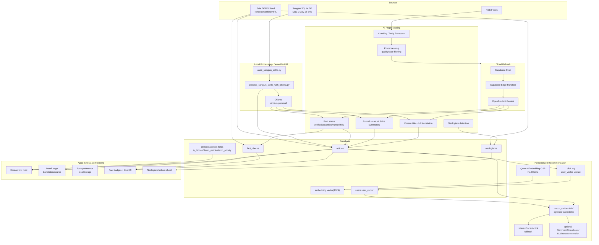

# Final Architecture

Samsun News is an Apps in Toss `.ait` mini-app backed by Supabase. The frontend does not call a custom production server.

## Runtime Boundaries

- `.ait` frontend: reads Supabase with anon key only, records onboarding interests and article clicks, and calls Supabase recommendation RPC when available.
- Supabase: production data platform and public read source.
- Local Ollama: demo/backfill only, running on the developer machine.
- Supabase Edge/Cron: cloud automation path using OpenRouter/Gemini, not local Ollama.
- Qwen3-Embedding-0.6B: article/user embedding model for pgvector recommendation through `backend/embedder.py`; article writes store 1024-dimensional vectors in `articles.embedding`.

## Embedding And RAG Implementation

- Schema: `supabase_schema.sql` creates `articles.embedding VECTOR(1024)`, `users.user_vector VECTOR(1024)`, and `match_articles(...)`.
- Embedding adapter: `backend/embedder.py` uses `LOCAL_EMBEDDING_MODEL=qwen3-embedding:0.6b` in local mode and fits all vectors to 1024 dimensions.
- Article upsert: `backend/save_articles.py` embeds `title_ko + translation` and writes `articles.embedding`.
- Frontend recommendation: `frontend/src/data/api.ts` stores `interest_tags`, records `user_logs`, updates `users.user_vector` with `old*0.6 + clicked*0.4` when embeddings exist, calls `match_articles`, and falls back to interest/recent-click/latest article ranking.
- Admin endpoints: `backend/main.py` exposes `/onboarding`, `/feed/{user_id}`, and `/users/{user_id}/click/{url_hash}` for local/admin testing.
- Optional reranking: `backend/rag.py` has a disabled-by-default reranking hook. Final demo messaging should describe it as a Gemma4/OpenRouter extension, not the default path.

## HITL Path

When an article contains ambiguous claims or insufficient evidence, the pipeline can mark:
- `fact_label=HITL_REQUIRED`
- `hitl_required=true` if the optional column exists

The UI displays this as `HITL 검토 필요`, signaling that human review is required before treating the item as verified.
