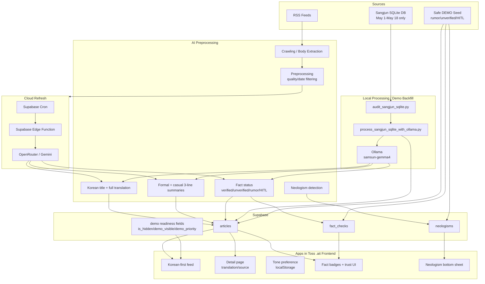

# Final Architecture

Samsun News is an Apps in Toss `.ait` mini-app backed by Supabase. The frontend does not call Railway or a custom production server.

## Runtime Boundaries

- `.ait` frontend: reads Supabase with anon key only.
- Supabase: production data platform and public read source.
- Local Ollama: demo/backfill only, running on the developer machine.
- Supabase Edge/Cron: cloud automation path using OpenRouter/Gemini, not local Ollama.

## HITL Path

When an article contains ambiguous claims or insufficient evidence, the pipeline can mark:
- `fact_label=HITL_REQUIRED`
- `hitl_required=true` if the optional column exists

The UI displays this as `HITL 검토 필요`, signaling that human review is required before treating the item as verified.
