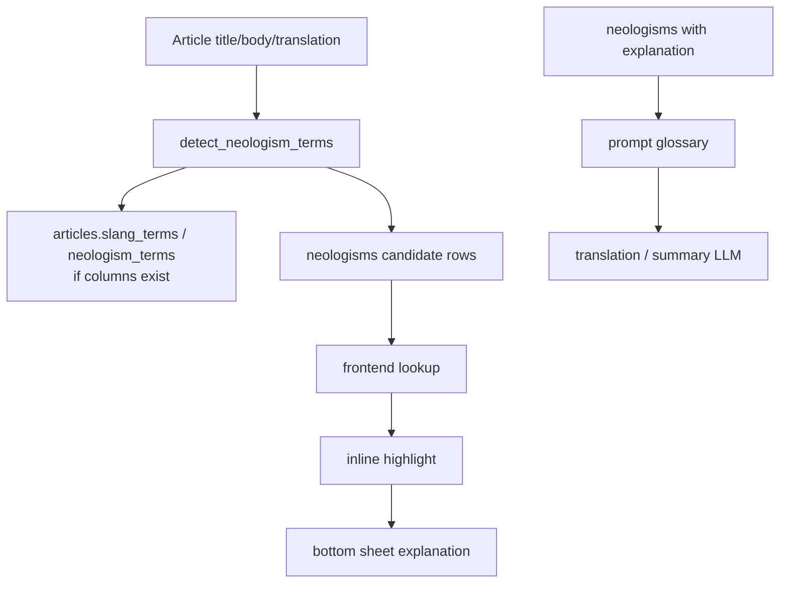

# 신조어 RAG / Neologism RAG

## 목적

삼선뉴스의 신조어 기능은 AI/테크 기사에 자주 등장하는 어려운 용어를 안전하게 설명하기 위한 기능입니다.

중요한 원칙:

- 모르는 용어를 LLM이 임의로 꾸며 설명하지 않습니다.
- Supabase `neologisms` 테이블에 등록되어 있고 `explanation`이 있는 용어만 UI에서 설명합니다.
- 신규 후보 용어는 저장/추적할 수 있지만, 설명 없는 후보는 사용자에게 설명으로 노출하지 않습니다.

## 현재 구현 상태

| 항목 | 상태 | 파일 |
| --- | --- | --- |
| `neologisms` 테이블 | 실제 구현 | `supabase_schema.sql` |
| `neologisms.embedding VECTOR(1024)` | 실제 구현 | `supabase_schema.sql`, `backend/sql/neologisms_pgvector.sql` |
| `match_neologisms` RPC | 실제 구현 | `supabase_schema.sql`, `backend/sql/neologisms_pgvector.sql` |
| 후보 용어 추출 | 실제 구현 | `backend/neologism_rag.py`, `scripts/sangjun_sqlite_common.py` |
| 번역 prompt glossary 주입 | 실제 구현 | `pipeline/translate_summarize.py`, `backend/neologism_rag.py` |
| `articles.slang_terms` / `articles.neologism_terms` 저장 | 부분 구현 | `backend/save_articles.py`, `backend/sql/add_pipeline_tracking_fields.sql` |
| frontend dictionary 조회 | 실제 구현 | `frontend/src/data/api.ts` |
| inline highlight | 실제 구현 | `frontend/src/components/NeologismText.tsx`, `frontend/src/data/neologismMatcher.ts` |
| 모바일 bottom sheet 설명 | 실제 구현 | `frontend/src/components/NeologismText.tsx`, `frontend/src/components/Overlay.tsx` |
| demo seed | 실제 구현 | `scripts/seed_demo_articles.py` |
| DB 품질 감사 | 실제 구현 | `scripts/audit_neologisms.py` |

## Supabase Schema / Migration

기본 schema:

```sql
-- supabase_schema.sql
CREATE TABLE IF NOT EXISTS neologisms (
    term VARCHAR PRIMARY KEY,
    explanation TEXT,
    ko_suggestion TEXT,
    first_seen_url_hash VARCHAR REFERENCES articles(url_hash) ON DELETE SET NULL,
    occurrence_count INT DEFAULT 1,
    confirmed BOOLEAN DEFAULT FALSE,
    embedding VECTOR(1024),
    source TEXT,
    created_at TIMESTAMPTZ DEFAULT NOW()
);
```

기존 DB에 추가 적용할 수 있는 migration:

```sql
-- backend/sql/neologisms_pgvector.sql
CREATE EXTENSION IF NOT EXISTS vector;
ALTER TABLE neologisms ADD COLUMN IF NOT EXISTS embedding VECTOR(1024);
ALTER TABLE neologisms ADD COLUMN IF NOT EXISTS source TEXT;
CREATE OR REPLACE FUNCTION match_neologisms(...);
```

기사별 용어 필드가 필요한 경우:

```sql
-- backend/sql/add_pipeline_tracking_fields.sql
ALTER TABLE articles ADD COLUMN IF NOT EXISTS slang_terms TEXT[] DEFAULT '{}';
ALTER TABLE articles ADD COLUMN IF NOT EXISTS neologism_terms TEXT[] DEFAULT '{}';
ALTER TABLE articles ADD COLUMN IF NOT EXISTS slang_processed_at TIMESTAMPTZ;
```

## Pipeline Flow



## Frontend Behavior

Frontend lookup:

- `fetchNeologismDictionary()`
- `fetchArticleNeologisms(urlHash)`
- `fetchNeologismsByTerms(terms)`

UI:

- `NeologismText` highlights summary/translation text only; source/title 영역은 하이라이트하지 않습니다.
- Matching policy lives in `frontend/src/data/neologismMatcher.ts`.
- Terms with a valid explanation are highlighted only when they pass strict safety filters.
- Mobile tap opens a bottom sheet.
- Desktop hover shows a tooltip.
- Lookup failure returns an empty list and does not block article rendering.

Highlight safety rules:

- `term` length must be at least 3 characters.
- `explanation` must be non-empty.
- Stopwords/source fragments such as `the`, `tech`, `guardian`, `meta`, `google`, `openai`, `ai`, `ml` are never highlighted.
- Matching uses word boundaries, so partial matches inside mixed Korean/English words are blocked.
- Longer terms win first, overlapping shorter terms are dropped.
- One term is highlighted only on its first occurrence.
- Each article text block highlights at most 4 terms.
- In final demo mode (`VITE_DEMO_POLISHED_FEED=1` or `VITE_HIDE_DEMO_ARTICLES=1`), highlighting is allowlist-only:
  `RAG`, `LLM`, `Fine-tuning`, `Prompt Injection`, `Guardrail`, `Hallucination`, `Inference`, `Token`, `Transformer`, `Embedding`, `HITL`, `CoVe`, `Re-ranking`, `pgvector`, `LoRA`.

Important demo fix:

- Generic/source/company terms such as `The`, `Tech`, `Meta`, `Google`, `OpenAI`, `AI`, `ML` are intentionally hidden even if the DB has rows for them.
- The bottom sheet always displays the clicked term object's own `explanation`. There is no fallback to the first dictionary entry or to a generic AI explanation.

## Unknown Term Policy

The frontend filters entries like this:

- `term` must exist.
- `explanation` must exist and be non-empty.
- If no explanation exists, the term is rendered as normal text.

Therefore:

- Unknown terms are not explained.
- The app does not fake explanations.
- Demo terms are explicitly seeded through `scripts/seed_demo_articles.py`.

## Demo Commands

Run migration in Supabase SQL Editor if needed:

```sql
-- supabase_schema.sql
-- backend/sql/neologisms_pgvector.sql
-- backend/sql/add_pipeline_tracking_fields.sql
```

Seed demo articles and neologisms:

```bash
python scripts/seed_demo_articles.py
```

Check demo readiness:

```bash
python scripts/audit_demo_readiness.py
```

Audit neologism dictionary quality:

```bash
python scripts/audit_neologisms.py
```

Open an article containing:

- `프롬프트 주입`
- `가드레일`
- `HITL`

Then tap the highlighted term and verify the bottom sheet explanation.

## 발표 문구

“신조어 설명은 LLM이 즉석에서 만들어내는 방식이 아니라, Supabase `neologisms` 테이블에 등록된 설명만 보여주는 RAG 방식입니다.”

“설명이 없는 unknown term은 하이라이트하지 않고, 임의 설명도 생성하지 않기 때문에 데모에서 잘못된 용어 설명을 사실처럼 보여주지 않습니다.”
