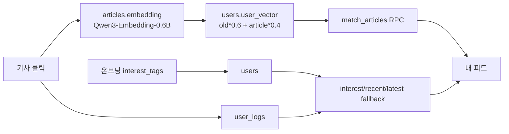
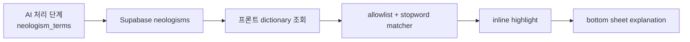

# Presentation Facts

이 문서는 최종 발표/PPT에서 말해도 되는 사실과, 후속 고도화로 표현해야 하는 항목을 구분하기 위한 발표자용 기준표입니다.

## 한 문장 소개

삼선뉴스는 해외 AI·IT 뉴스를 한국어 제목, 전문 번역, 격식체/일상체 3줄 요약, 신조어 설명, fact label, 개인화 추천 피드로 재구성해 Apps in Toss에서 제공하는 AI 뉴스 큐레이션 미니앱입니다.

## 최종 제품 구조

| 항목 | 발표 기준 |
| --- | --- |
| 플랫폼 | Apps in Toss `.ait` 미니앱 |
| 프론트엔드 | React 18 + Vite + TypeScript + TDS Mobile |
| 최종 데이터 소스 | Supabase `public.articles` |
| 원천 기사 DB | `samsun_345.db` SQLite, 앱이 직접 읽지 않음 |
| AI 처리 경로 | SQLite/RSS -> Gemma4 E4B/Ollama -> Supabase upsert -> `.ait` 조회 |
| cloud refresh | Supabase Edge/Cron + OpenRouter/Gemini |
| 최종 산출물 | `frontend/samsun-newsapp.ait` |

## 발표에서 말해도 되는 구현 기능

| 기능 | 상태 | 말해도 되는 표현 |
| --- | --- | --- |
| 한국어 뉴스 피드 | 구현 | 해외 AI·IT 뉴스를 한국어 제목, 번역 전문, 3줄 요약으로 보여준다 |
| 격식체/일상체 | 구현 | 사용자가 선택한 말투를 localStorage에 저장해 카드/상세에 적용한다 |
| 원문 링크 | 구현 | `url -> source_url -> original_url` fallback으로 유효한 원문 링크를 연다 |
| 핫이슈 | 구현 | 조회 로그가 없어도 최신/신뢰도 기반 fallback으로 빈 화면을 방지한다 |
| 7개 카테고리 | 구현 | AI 연구, AI 심층, AI 스타트업, AI 윤리, AI 비즈니스, AI 커뮤니티, 테크 전반 |
| 개인화 추천 | 구현 | interest_tags, user_logs, user_vector, match_articles RPC와 fallback을 사용한다 |
| 신조어 RAG | 구현 | Supabase `neologisms`에 등록된 설명만 bottom sheet로 보여준다 |
| fact label | 구현 | FACT/UNVERIFIED/RUMOR/INSIGHT/HITL_REQUIRED 상태를 카드/상세에 표시한다 |
| fact insight | 구현 | `fact_reason`/`fact_insight`가 있는 경우 상세에 보수적 설명을 표시한다 |
| HITL | 구현 범위 제한 | 완전한 관리자 승인 시스템이 아니라 검토 대상 분리 및 표시 구현 |

## 모델 전략

| 모델/기술 | 최종 역할 |
| --- | --- |
| Gemma4 E4B | 번역, 요약, 카테고리 분류, fact label 생성의 메인 모델 |
| Qwen3-Embedding-0.6B | 기사/사용자 embedding 전용 |
| Supabase pgvector | 사용자 벡터 기반 후보 검색 |
| Qwen 계열 번역 모델 | 초기 실험에서 한자 혼입 이슈가 있어 최종 메인 번역 모델에서 제외 |
| Qwen3.5 | 최종 추천 LLM으로 사용하지 않음 |
| LLM Re-ranking | 최종 데모 기본 비활성, Gemma4 기반 후속 확장 옵션 |

## 개인화 추천 설명 3문장

1. 삼선뉴스는 온보딩 관심사와 기사 클릭 이력을 Supabase `users`, `user_logs`에 저장해 사용자별 관심 프로필을 만든다.
2. 클릭한 기사에 1024차원 embedding이 있으면 `users.user_vector = old * 0.6 + article * 0.4`로 갱신하고, `match_articles` RPC로 유사한 후보를 가져온다.
3. RPC나 embedding이 없을 때도 앱이 깨지지 않도록 관심 카테고리, 최근 클릭 카테고리, 최신 완성 기사 기반 fallback 추천을 제공한다.



## 신조어 RAG 설명



발표 표현:
- “모르는 용어는 임의 생성하지 않고, Supabase `neologisms.explanation`이 있는 등록 용어만 설명합니다.”
- “`The`, `Tech`, `AI`, `Meta`, `Google`, `OpenAI`, `Anthropic`, `Nvidia` 같은 일반 단어/회사명/출처명은 발표용 하이라이트에서 제외했습니다.”

## Fact label / HITL 표현

발표 표현:

> 팩트체크 파이프라인은 testset 200건과 DebateCV 검증용 실제 기사 1건, 총 201건으로 평가했으며, 최종 신뢰도 분류 정확도 98.5%, RUMOR recall 1.0, FACT F1 0.989를 달성했다. 앱에서는 AI가 자동 판정한 `FACT`/`UNVERIFIED`/`RUMOR`/`INSIGHT` 라벨을 표시하고, 자동 판정만으로 어려운 기사는 전문가 검토 필요(`HITL_REQUIRED`) 대상으로 분리한다. `INSIGHT`는 TIER 0/1 전문가 사설·분석글을 DROP하지 않고 보존하기 위한 라벨이다.

슬라이드용 3문장:

1. 수집 직후 팩트체커가 FACT/RUMOR/UNVERIFIED/INSIGHT/DROP 5라벨을 먼저 판정합니다.
2. 자동 판정이 불확실한 기사는 전문가 검토 필요 상태로 분리해 사람이 확인할 수 있게 설계했습니다.
3. 201건 평가에서 최종 정확도 98.5%, RUMOR recall 1.0을 달성했습니다.

앱 표시 기준:

| 내부 라벨 | 사용자 표시 | 설명 |
| --- | --- | --- |
| `FACT` / `VERIFIED` | 검증됨 | 신뢰도 높은 출처와 명확한 보도 형식으로 확인된 기사 |
| `UNVERIFIED` | 확인 필요 | 독립 교차검증 정보가 부족해 추가 확인이 필요한 기사 |
| `RUMOR` | 루머 주의 | 공식 발표보다 추정성 표현이 많아 주의가 필요한 기사 |
| `INSIGHT` | 분석글 | 사실 보도보다 전문가 해설·관점이 중심인 기사 |
| `HITL_REQUIRED` / `HITL` / `HUMAN_REVIEW` | 전문가 검토 필요 | 자동 판정만으로는 판단이 어려워 사람이 추가 확인해야 하는 기사 |
| `DROP` | 사용자 피드 미노출 | 노이즈 또는 최종 피드 부적합 항목 |

주의:
- “완전한 관리자 승인 시스템 구현 완료”라고 말하지 않는다.
- “전문가 검토 대상 분리 및 표시 구현”이라고 표현한다.
- `INSIGHT`는 “전문가 분석글 보존 라벨”로 설명한다.
- fact insight는 보수적 설명이며, 없는 경우 빈 박스를 띄우지 않는다.

## 데이터 수집 슬라이드 구조

| 구분 | 소스 |
| --- | --- |
| 언론사 RSS | TechCrunch, MIT Technology Review, The Verge, VentureBeat AI, The Guardian Tech, IEEE Spectrum, The Decoder |
| 커뮤니티 | Lemmy Technology, Hacker News AI/LLM/ML |
| 제외 | Reddit |

Reddit 제외 이유:

> 초기에는 Reddit 계열 커뮤니티 수집도 검토했으나, API/RSS 접근 정책 변화와 데이터 라이선싱 리스크로 인해 최종 수집 대상에서 제외했습니다. 대신 Lemmy API와 Hacker News hnrss.org를 활용해 커뮤니티 기반 AI/LLM/ML 소스를 안정적으로 수집했습니다.

## 최종 데모 데이터 스냅샷

| 항목 | 값 |
| --- | ---: |
| 최종 노출 가능 기사 수 | 104 |
| DEMO/[시연용] 노출 위반 | 0 |
| 미완성 노출 위반 | 0 |
| URL 없는 노출 기사 | 0 |
| invalid URL | 0 |
| 핫이슈 후보 | 104 |
| visible fact insight/reason 보유 기사 | 40 |
| visible HITL_REQUIRED 기사 | 2 |

카테고리 분포:

| 카테고리 | 기사 수 |
| --- | ---: |
| AI 연구 | 16 |
| AI 심층 | 13 |
| AI 스타트업 | 7 |
| AI 윤리 | 15 |
| AI 비즈니스 | 37 |
| AI 커뮤니티 | 8 |
| 테크 전반 | 8 |

## Apps in Toss 시연 순서

1. Toss Console test8에 `frontend/samsun-newsapp.ait` 업로드
2. 실기기 Toss 앱에서 삼선뉴스 실행
3. 홈 피드: 한국어 제목, 3줄 요약, 카테고리, fact label 확인
4. 카테고리: 7개 카테고리 탭 확인
5. 상세: 격식체/일상체 전환, 번역 전문, 원문 링크 확인
6. 핫이슈: 빈 화면 없이 후보 표시 확인
7. 내 피드: 개인화 추천과 deterministic reason 확인
8. 신조어: 하이라이트 탭 후 bottom sheet 설명 확인
9. Fact/HITL: 라벨과 fact insight 확인

## Supabase SQL Editor 적용 목록

발표 전 반드시 실행:

```text
backend/sql/final_demo_supabase_patch.sql
```

이 SQL은 `public.articles` 기준 `match_articles` RPC를 다시 만들고, `record_article_view`, `save_user_interests`, `blend_vectors_1024`, `users`, `user_logs`, `source_url/original_url`, `fact_reason/fact_insight`, demo visibility 필드를 보강한다. GitHub push만으로 Supabase SQL이 자동 적용되지는 않는다.

발표 전 실행하지 않아도 됨:

```text
backend/sql/optional_pgvector_indexes.sql
```

벡터 인덱스는 선택사항이다. Supabase free tier에서는 `maintenance_work_mem` 한도 때문에 ivfflat/hnsw index 생성이 실패할 수 있으므로, 발표용 소규모 데이터에서는 `final_demo_supabase_patch.sql`만 실행하면 된다.

## 후속 고도화로 말해야 하는 기능

- HITL 관리자 승인/반려 페이지
- Gemma4 기반 LLM Re-ranking
- 전체 기사 embedding 대규모 backfill
- 정량 평가 확대: 번역 품질, 요약 품질, 추천 만족도
- Supabase Edge/Cron refresh 운영 모니터링

## 말하면 안 되는 표현

- “Qwen3.5가 최종 추천 LLM이다”
- “LLM Re-ranking이 최종 데모 기본 경로다”
- “Reddit을 최종 커뮤니티 수집 소스로 쓴다”
- “완전한 HITL 관리자 승인 시스템을 구현했다”
- “SQLite DB를 앱이 직접 읽는다”
- “DEMO/미완성 기사를 최종 피드에 노출한다”
