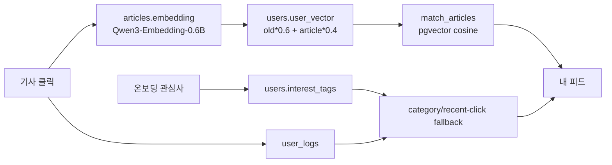
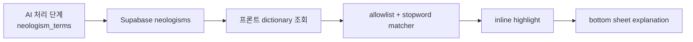
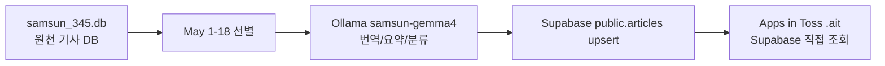

# Presentation Facts

## 발표에서 말해도 되는 최종 구현 기능

- Apps in Toss `.ait` 모바일 앱은 Supabase를 직접 조회한다.
- 발표용 피드는 DEMO/[시연용]/미완성/숨김 기사를 제외하고, 완성된 실제 기사만 우선 노출한다.
- 온보딩 관심사는 `users.interest_tags`에 저장된다.
- 기사 클릭은 `user_logs`에 저장된다.
- 클릭한 기사에 `embedding`이 있으면 `users.user_vector = old * 0.6 + article * 0.4`로 갱신한다.
- 내 피드는 Supabase `match_articles` pgvector RPC를 우선 사용하고, 실패 시 관심 카테고리/최근 클릭 카테고리/최신 완성 기사 fallback을 사용한다.
- 신조어 설명은 Supabase `neologisms`에 등록된 설명만 사용한다. `The`, `Tech`, `AI`, `Meta`처럼 일반 단어나 설명 없는 용어는 발표용 하이라이트에서 제외한다.
- 팩트 라벨은 `검증됨`, `미검증`, `루머 의심`, `HITL 검토 필요`로 표시한다.

## 추천 기능 구현 상태 표

| 기능명 | 상태 | 파일 위치 | 발표 가능 여부 |
| --- | --- | --- | --- |
| 온보딩 관심사 저장 | 실제 구현 | `frontend/src/pages/OnboardingPage.tsx`, `frontend/src/data/api.ts`, `users.interest_tags` | 가능 |
| user_vector 생성 | 부분 구현 | `backend/rag.py`, `backend/embedder.py` | 관리/백필 경로는 가능. 프론트는 embedding 없이 category fallback |
| 기사 클릭 로그 | 실제 구현 | `frontend/src/App.tsx`, `frontend/src/pages/MyFeedPage.tsx`, `frontend/src/data/api.ts`, `user_logs` | 가능 |
| 클릭 기사 embedding 기반 user_vector 갱신 | 실제 구현 | `frontend/src/data/api.ts`, `backend/rag.py` | embedding 있는 기사 기준 가능 |
| pgvector 후보 검색 | 실제 구현 | `supabase_schema.sql`, `backend/sql/personalized_recommendation_pgvector.sql`, `match_articles` | 가능 |
| 내 피드 추천 표시 | 실제 구현 | `frontend/src/pages/MyFeedPage.tsx`, `frontend/src/data/api.ts` | 가능 |
| fallback 추천 | 실제 구현 | `frontend/src/data/api.ts` | 가능 |
| LLM Re-ranking | 선택형/기본 비활성 | `backend/rag.py` | 후속 고도화로만 설명 |

## 후속 고도화로 말해야 하는 기능

- LLM Re-ranking은 최종 Apps in Toss 데모 기본 경로가 아니다.
- Qwen3.5-4B를 최종 추천 LLM으로 사용한다고 말하지 않는다.
- Gemma4/OpenRouter 기반 LLM reranking은 pgvector 후보를 받은 뒤 적용할 수 있는 선택형 확장안이다.
- 정량 평가(BLEU/COMET/G-Eval)와 대규모 임베딩 백필은 후속 개선 항목이다.

## 개인화 추천 설명 3문장

1. 삼선뉴스는 온보딩에서 선택한 관심 카테고리와 기사 클릭 이력을 Supabase에 저장해 사용자별 프로필을 만든다.
2. 클릭한 기사에 1024차원 Qwen3 embedding이 있으면 user_vector에 40% 반영하고, Supabase pgvector `match_articles`로 유사한 기사 후보를 찾는다.
3. 임베딩이나 RPC가 없는 환경에서도 앱이 깨지지 않도록 관심사, 최근 클릭 카테고리, 최신 완성 기사 기반 fallback 추천을 제공한다.

## RAG 추천 슬라이드 구조



## 신조어 RAG 슬라이드 구조



정책: 모르는 용어는 임의 설명하지 않고, `neologisms.explanation`이 있는 등록 용어만 설명한다.

## Apps in Toss 시연 순서

1. Toss Console 테스트 앱에 `frontend/samsun-newsapp.ait` 업로드.
2. 실기기 Toss 앱에서 삼선뉴스 실행.
3. 홈 피드에서 한국어 제목, 3줄 요약, 팩트 라벨, 카테고리 배지 확인.
4. 기사 상세에서 번역 전문, 원문 보기, 격식체/일상체 전환 확인.
5. 신조어 하이라이트를 탭해 bottom sheet 설명 확인.
6. 내 피드에서 관심사 기반 개인화 추천과 추천 이유 확인.
7. 발표에서는 `python scripts/audit_demo_readiness.py`와 `python scripts/audit_recommendation_flow.py --dry-run` 결과로 데이터/추천 상태를 보강 설명.

## 데이터 노출 정책

- DEMO/[시연용]/mock 기사는 최종 발표용 피드에서 숨긴다.
- `is_hidden=true` 또는 `demo_visible=false`는 노출하지 않는다.
- `title_ko`, `translation`, `summary_formal`/`summary_casual`, `fact_label`이 부족한 미완성 기사는 노출하지 않는다.
- 2026-05-01부터 2026-05-18까지 상준 SQLite DB에서 AI 처리된 실제 기사와 안전한 Supabase 행만 최종 피드 후보로 사용한다.

## 최종 데이터 흐름



앱은 `samsun_345.db`를 직접 읽지 않는다. SQLite는 발표용 원천 기사 저장소이고, 최종 런타임 데이터 소스는 Supabase `public.articles`다.

## Supabase SQL Editor 적용 목록

발표 전 Supabase SQL Editor에서 실행할 최종 패치:

```text
backend/sql/final_demo_supabase_patch.sql
```

이 SQL은 `public.articles` 기준 `match_articles` RPC를 다시 만들고, `users`, `user_logs`, `source_url/original_url`, `fact_reason/fact_insight`, demo visibility 필드를 보강한다. GitHub push만으로 Supabase SQL이 자동 적용되지는 않는다.

벡터 인덱스는 선택사항이다. Supabase free tier에서는 `maintenance_work_mem` 한도 때문에 ivfflat/hnsw index 생성이 실패할 수 있으므로, 발표 전에는 `final_demo_supabase_patch.sql`만 실행해도 된다. 성능 인덱스가 필요할 때만 별도 파일을 실행한다:

```text
backend/sql/optional_pgvector_indexes.sql
```

## 커뮤니티 수집 소스

- Lemmy Technology: RSS + Lemmy API `post_view.post.embed_description`.
- Hacker News AI/LLM/ML: hnrss.org keyword RSS.
- Reddit은 API/RSS 정책 변화와 데이터 라이선싱 리스크 때문에 최종 수집 대상에서 제외했다.

## 최종 산출물

- Apps in Toss 업로드 파일: `frontend/samsun-newsapp.ait`
- 빌드 명령: `cd frontend && npm run ait:build`
